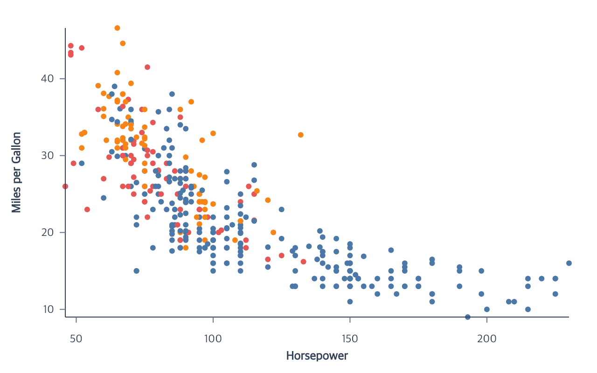
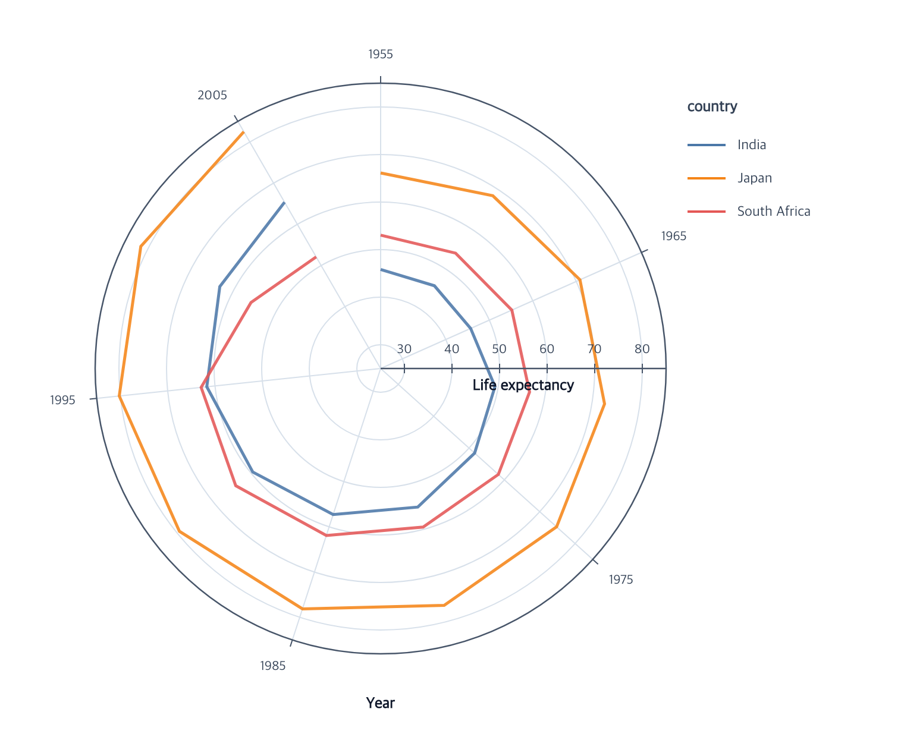
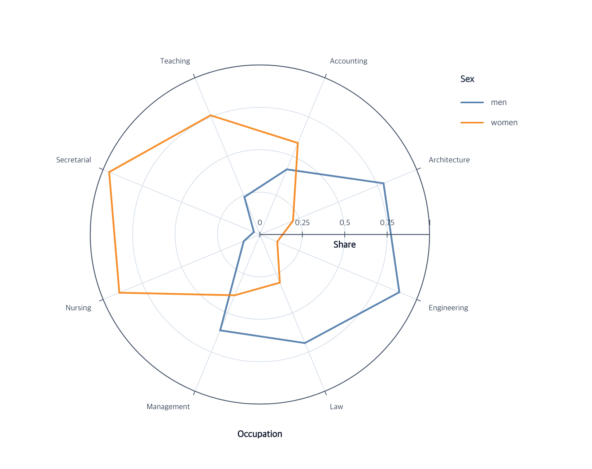
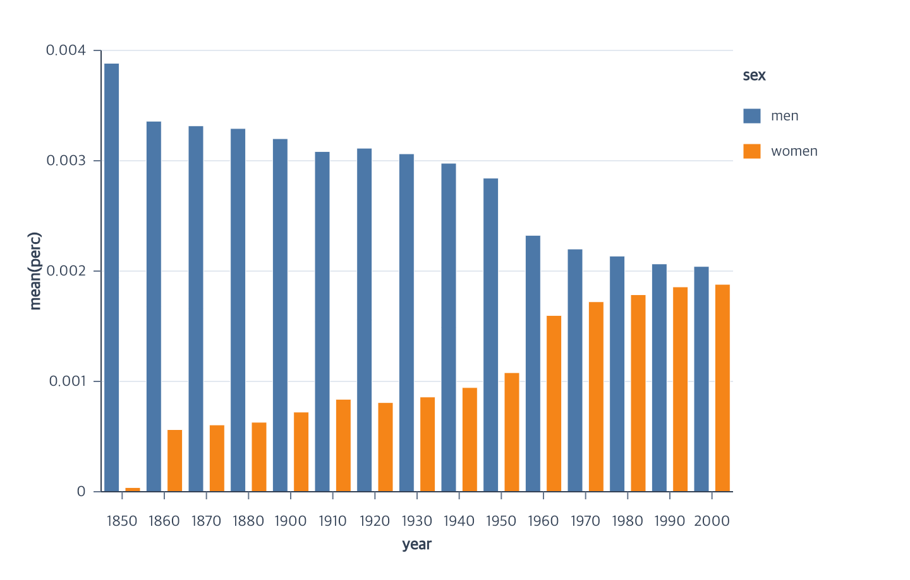
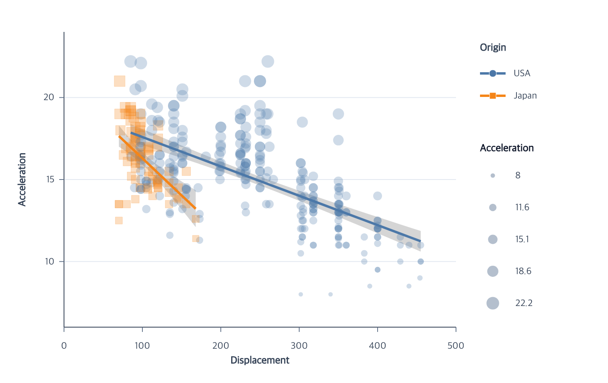
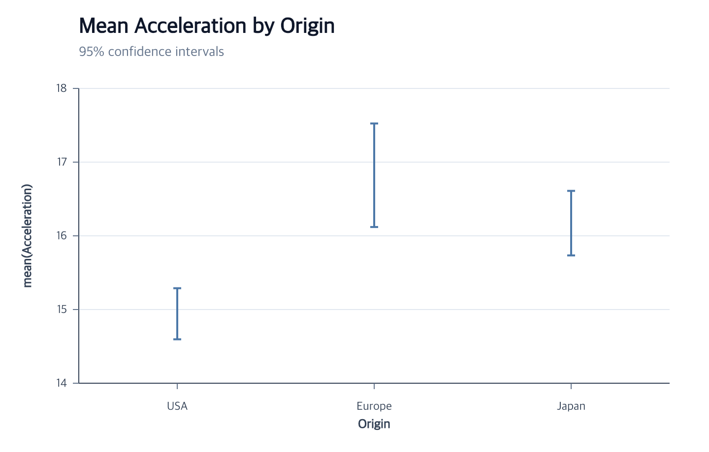
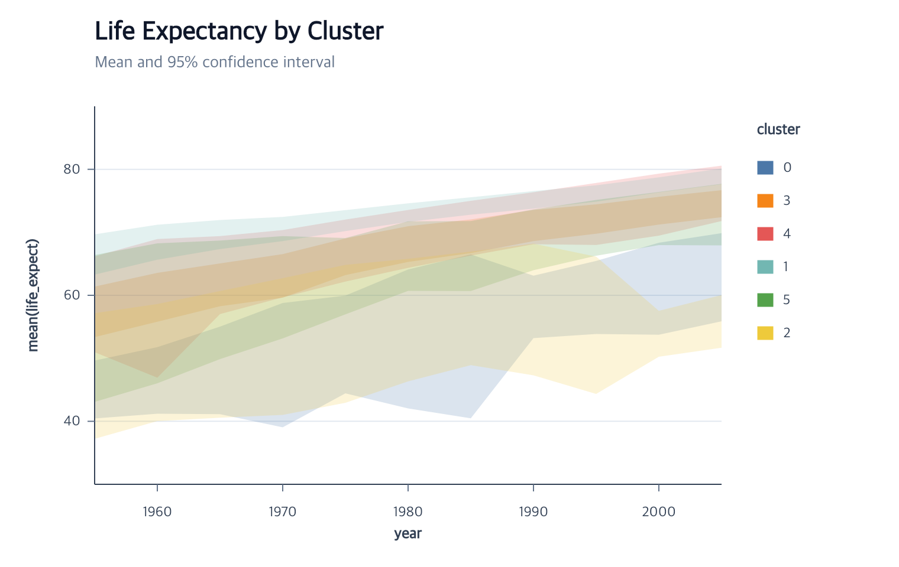

# ggaction Documentation

Build charts as immutable, traceable action programs. Start with a complete
example, then use the API pages when you need to customize one part.
The main, extension, and PNG entry points include TypeScript declarations.

> **Release status:** This documentation describes the experimental `{{ site.version }}`
> release. APIs may change before `1.0.0`; consult the
> [changelog](https://github.com/hj-n/ggaction/blob/main/CHANGELOG.md) when
> upgrading.

## Start here

  <a href="./getting-started/">
    <strong>Build your first chart</strong>
    Install the package, render a complete chart, and understand the action chain.
  </a>
  <a href="./recipes/">
    <strong>Start from a chart type</strong>
    Copy the shortest supported scatterplot, line, bar, or area flow.
  </a>
  <a href="./reference/actions/">
    <strong>Find an action</strong>
    Look up exact signatures, defaults, inference, and related guides.
  </a>

## Core charts

Start with a complete chart whose data relationship matches the question you
want to answer.

  <article>
    
    <a class="docs-chart-gallery__title" href="./tutorials/scatterplot/">Scatterplot</a>
    
Compare two quantitative fields and encode a category with color.

    <code>createPointMark</code> <code>encodeX</code> <code>encodeY</code>
    <a class="docs-chart-gallery__full-size" href="./assets/images/cars-scatterplot.png">View full size</a>
  </article>
  <article>
    
    <a class="docs-chart-gallery__title" href="./tutorials/polar-points/">Polar points</a>
    
Map quantitative fields to clockwise angle and radial distance.

    <code>encodeTheta</code> <code>encodeR</code>
    <a class="docs-chart-gallery__full-size" href="./assets/images/cars-polar-scatterplot.png">View full size</a>
  </article>
  <article>
    
    <a class="docs-chart-gallery__title" href="./tutorials/polar-points/#add-polar-guides">Polar guides</a>
    
Read angle and radial mappings with aligned axes, ticks, labels, and grids.

    <code>createGuides</code> <code>editRadialAxis</code>
    <a class="docs-chart-gallery__full-size" href="./assets/images/cars-polar-guides.png">View full size</a>
  </article>
  <article>
    
    <a class="docs-chart-gallery__title" href="./tutorials/polar-lines/">Polar lines</a>
    
Connect ordered angle and radial values as grouped open paths.

    <code>createLineMark</code> <code>encodeTheta</code> <code>encodeR</code>
    <a class="docs-chart-gallery__full-size" href="./assets/images/gapminder-polar-trends.png">View full size</a>
  </article>
  <article>
    
    <a class="docs-chart-gallery__title" href="./tutorials/polar-lines/#closed-radar-paths">Radar chart</a>
    
Close nominal-angle series without duplicating the first observation.

    <code>createLineMark</code> <code>closed</code>
    <a class="docs-chart-gallery__full-size" href="./assets/images/jobs-radar-chart.png">View full size</a>
  </article>
  <article>
    
    <a class="docs-chart-gallery__title" href="./tutorials/line-chart/">Line chart</a>
    
Aggregate values over time and split the result into series.

    <code>createLineMark</code> <code>encodeGroup</code>
    <a class="docs-chart-gallery__full-size" href="./assets/images/cars-line-chart.png">View full size</a>
  </article>
  <article>
    
    <a class="docs-chart-gallery__title" href="./tutorials/histogram/">Histogram</a>
    
Bin a quantitative field and count category partitions.

    <code>createBarMark</code> <code>encodeHistogram</code>
    <a class="docs-chart-gallery__full-size" href="./assets/images/cars-histogram.png">View full size</a>
  </article>
  <article>
    
    <a class="docs-chart-gallery__title" href="./tutorials/grouped-bar/">Bar chart</a>
    
Aggregate ordinal categories and arrange nominal groups side by side.

    <code>createBarMark</code> <code>encodeColor</code>
    <a class="docs-chart-gallery__full-size" href="./assets/images/jobs-grouped-bar.png">View full size</a>
  </article>
  <article>
    
    <a class="docs-chart-gallery__title" href="./tutorials/density-area/">Density area</a>
    
Estimate grouped distributions and draw baseline-closed areas.

    <code>createAreaMark</code> <code>encodeDensity</code>
    <a class="docs-chart-gallery__full-size" href="./assets/images/cars-density-area.png">View full size</a>
  </article>

## Statistical and layered charts

These examples compose ordinary marks and derived data into higher-level
statistical views.

  <article>
    
    <a class="docs-chart-gallery__title" href="./tutorials/regression-scatterplot/">Regression scatterplot</a>
    
Layer observations, grouped fits, and confidence bands.

    <code>createRegression</code>
    <a class="docs-chart-gallery__full-size" href="./assets/images/cars-regression-scatterplot.png">View full size</a>
  </article>
  <article>
    
    <a class="docs-chart-gallery__title" href="./tutorials/error-bar/">Error bar</a>
    
Keep observations visible while summarizing group uncertainty.

    <code>createErrorBar</code>
    <a class="docs-chart-gallery__full-size" href="./assets/images/cars-error-bar.png">View full size</a>
  </article>
  <article>
    
    <a class="docs-chart-gallery__title" href="./api/box-plots/">Box plot</a>
    
Compose quartiles, whiskers, medians, and outlier points.

    <code>createBoxPlot</code>
    <a class="docs-chart-gallery__full-size" href="./assets/images/cars-box-plot.png">View full size</a>
  </article>
  <article>
    
    <a class="docs-chart-gallery__title" href="./tutorials/error-band/">Error band</a>
    
Show interval ribbons with explicit lower and upper boundaries.

    <code>createErrorBand</code>
    <a class="docs-chart-gallery__full-size" href="./assets/images/gapminder-error-band.png">View full size</a>
  </article>

## Go deeper

Understand [immutable ChartProgram state](./concepts/chart-program.md),
[semantic and graphical state](./concepts/semantic-and-graphics.md), and
[action trace trees](./concepts/actions-and-trace.md). Extension authors can
continue with [action authoring](./extension/action-authoring.md) and the
[primitive API](./extension/primitives.md). For boundaries and failures, see
[supported features](./supported-features.md) and
[troubleshooting](./troubleshooting.md). Language models can use the concise
[documentation index](./llms.txt) or the generated
[full-text bundle](./llms-full.txt).

Source, issues, and development history are available on
[GitHub](https://github.com/hj-n/ggaction).
