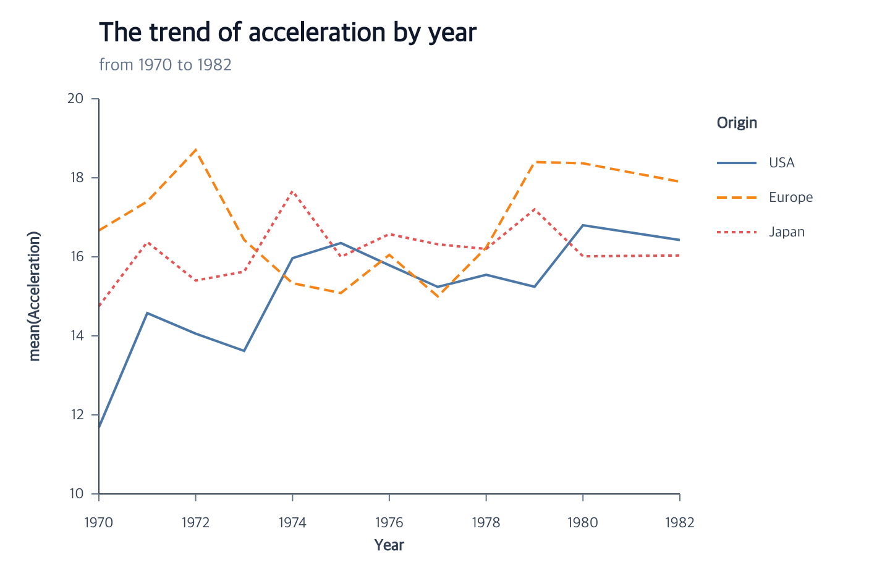

# ggaction Documentation

Build charts as immutable, traceable action programs. Start with a complete
example, then use the API pages when you need to customize one part.

> **Development status:** `ggaction` is currently used directly from this
> repository and is not published to npm yet. The documented API version is
> `0.0.0-dev`.

## Build a chart

1. [Getting started](./getting-started.md) — render a complete chart from a
   small inline dataset.
2. [Cars scatterplot tutorial](./tutorials/scatterplot.md) — map quantitative
   fields to points.
3. [Cars line chart tutorial](./tutorials/line-chart.md) — aggregate temporal
   series and add guides and a title.
4. [Chart API reference](./reference/actions.md#chart-authoring-api) — find an
   action and its exact signature.

## Understand the model

- [ChartProgram and immutability](./concepts/chart-program.md)
- [Semantic and graphical state](./concepts/semantic-and-graphics.md)
- [Actions and trace trees](./concepts/actions-and-trace.md)

## Chart API

- [Canvas](./api/canvas.md)
- [Data](./api/data.md)
- [Marks](./api/marks.md)
- [Encodings](./api/encodings.md)
- [Coordinates](./api/coordinates.md)
- [Guides](./api/guides.md)
- [Axes](./api/axes.md)
- [Grids](./api/grids.md)
- [Legends](./api/legends.md)
- [Titles](./api/titles.md)
- [Browser and PNG rendering](./api/rendering.md)

## Go deeper

- [Advanced axis components](./advanced/axis-components.md)
- [Author custom actions](./extension/action-authoring.md)
- [Primitive extension API](./extension/primitives.md)
- [Supported features](./supported-features.md)
- [Complete action index](./reference/actions.md)
- [LLM documentation index](./llms.txt)

Source, issues, and development history are available on
[GitHub](https://github.com/hj-n/ggaction).
