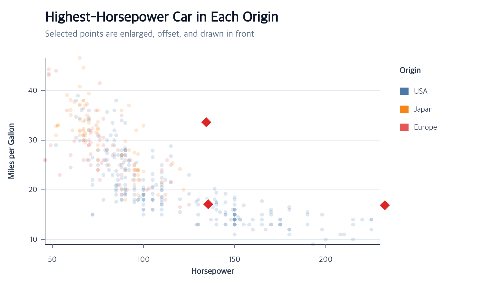
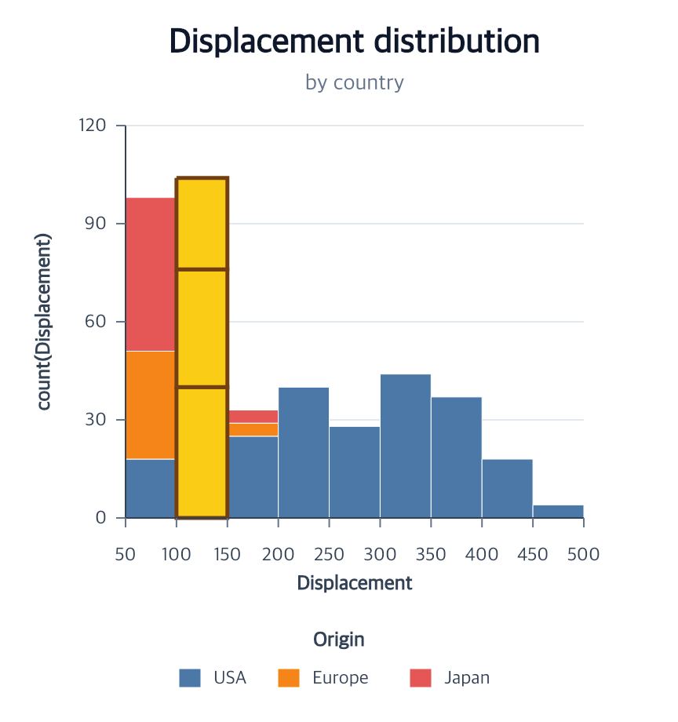
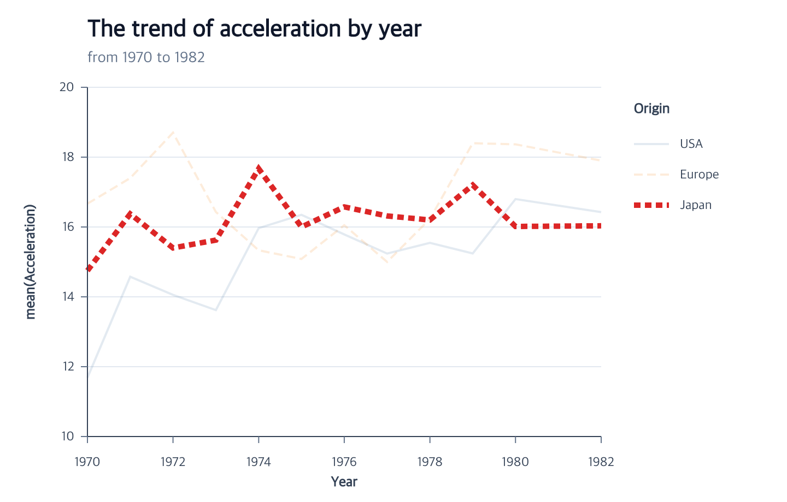

# Mark Selection and Highlighting Tutorial

Select final visual items by data field, semantic channel, or concrete graphic
property, then filter, reuse, or highlight that selection. The repository
contains a [runnable browser example](https://github.com/hj-n/ggaction/tree/main/examples/mark-selection)
and the [canonical programs](https://github.com/hj-n/ggaction/blob/main/examples/mark-selection/program.js)
used by the acceptance and PNG tests below.

## Highlight grouped maximum points



The selector runs at point-item grain. `groupBy: "Origin"` chooses one maximum
Horsepower row per Origin; styling happens only after the three semantic items
have been selected.

```javascript
program.highlightMarks({
  target: "points",
  select: {
    field: "Horsepower",
    op: "max",
    groupBy: "Origin"
  },
  color: "#dc2626",
  shape: "diamond",
  size: 5.5,
  offset: { x: 7, y: -7 },
  dimOthers: { opacity: 0.18 }
});
```

`size` is an area multiplier and `offset` uses logical Canvas pixels. The
selected points are placed last by default, while their x/y semantic values
remain unchanged.

## Select a complete histogram stack



For bars, semantic endpoints and concrete dimensions are intentionally
separate. `channel: "y2"` compares the upper semantic endpoint. With
`grain: "stack"`, every colored rectangle attached to the tallest bin is one
selected item.

```javascript
program.highlightMarks({
  target: "bars",
  select: {
    grain: "stack",
    channel: "y2",
    op: "max"
  },
  fill: "#facc15",
  stroke: "#713f12",
  strokeWidth: 2.5
});
```

Use `{ property: "height", op: "max" }` only when the intended comparison is
the rendered pixel height. The default item grain would select only the
topmost matching rectangle rather than the complete stack.

## Highlight one line series



A multi-row line is one series item. The selected field must therefore have
one unique value over the complete path.

```javascript
program.highlightMarks({
  target: "trends",
  select: { field: "Origin", op: "eq", value: "Japan" },
  stroke: "#dc2626",
  strokeWidth: 5,
  strokeDash: "dashed",
  dimOthers: { opacity: 0.16 }
});
```

When the selector matches complete categories in the line's categorical
legend, legend symbols receive the same emphasis and dimming. Legend text
remains fully readable.

## Choose filtering, reusable selection, or highlighting

| Action | Stored result | Graphical result |
| --- | --- | --- |
| `filterMarks` | Immutable member-row dataset and explicit mark rebind | Scales, mark, axes, grids, and legend rematerialize |
| `selectMarks` | Reusable normalized selector intent | None until another action uses the selection |
| `highlightMarks` | Selection plus mark-specific appearance assignment | Selected style, optional complement dimming, selected-last order |

Create a reusable selection when more than one later action should refer to the
same items:

```javascript
const selected = program.selectMarks({
  id: "japanSeries",
  target: "trends",
  field: "Origin",
  op: "eq",
  value: "Japan"
});

const highlighted = selected.highlightMarks({
  selection: "japanSeries",
  stroke: "#dc2626"
});
```

Selection intent is reevaluated after compatible Canvas, scale, encoding, and
data-cardinality changes. It does not store stale child IDs.

## Run and continue

- Serve the repository root and open `examples/mark-selection/`.
- Read the complete [selector and appearance tables](../api/appearance.md#mark-selection-and-highlighting).
- Use [`filterMarks`](../api/data.md#filtermarks-target-selector) when matching items should replace the target mark's data.
- Use [`editBarMark`](../api/marks.md#editbarmark-target-fill-opacity-stroke-strokewidth) for whole-bar appearance rather than selected items.
